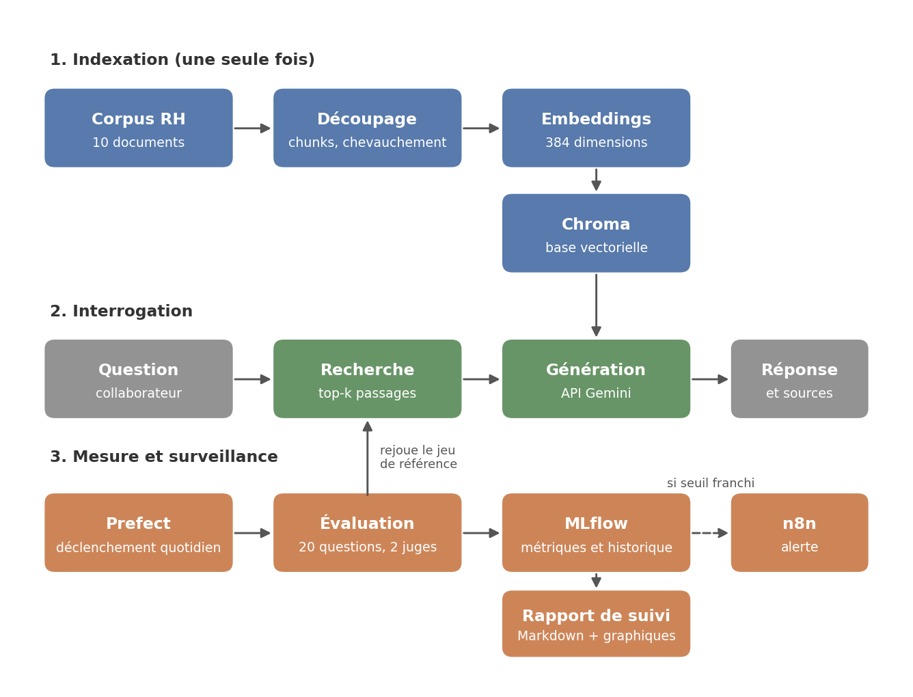
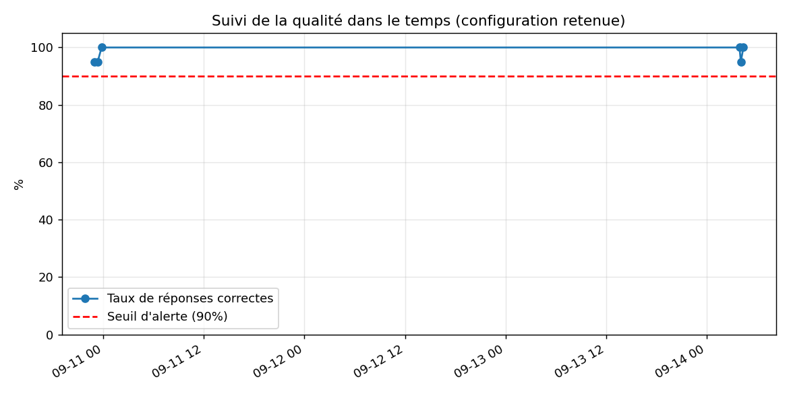

# Assistant RAG en production avec évaluation continue de la qualité

**Exercice C2 — Master 1 Intelligence Artificielle et Science des Données**

Code source : https://github.com/N4212/rag-assistant-rh

---

## 1. Contexte métier et problématique

Le département des ressources humaines d'une entreprise cherche à mettre à
disposition de ses collaborateurs un assistant capable de répondre à leurs
questions à partir des procédures internes existantes. Le bénéfice est double :
le service RH cesse de traiter manuellement des demandes répétitives, et le
collaborateur obtient une réponse immédiate, à toute heure, sans avoir à
solliciter un interlocuteur pour une question qu'il juge parfois trop mineure
pour être posée.

L'approche retenue est le RAG (Retrieval-Augmented Generation). Comparée à une
recherche par mots-clés, elle permet de retrouver les passages dont le sens
correspond à la question, même lorsque la formulation diffère de celle du
document : « comment poser des congés » et « procédure de demande de vacances »
n'ont presque aucun terme en commun, mais expriment la même intention. Comparée
à l'usage d'un grand modèle de langage seul, sans corpus, elle évite que le
système invente des procédures plausibles mais étrangères à l'entreprise — ce
qui reviendrait à diffuser de fausses informations auprès des salariés.

Une fois l'outil livré et calibré, rien ne garantit qu'il conservera le niveau
de qualité mesuré le premier jour. Les procédures RH évoluent : une convention
est révisée, un barème change, une note interne est reformulée. Le fournisseur
du modèle de langage peut lui aussi modifier son offre, retirer une version ou
durcir ses quotas. Ces deux risques n'ont toutefois pas la même nature. Un
changement de modèle provoque une panne visible, que l'on détecte
immédiatement. Une procédure modifiée, elle, ne casse rien : l'assistant
continue de répondre avec la même assurance et cite une source qui existe
réellement, mais dont le contenu est désormais périmé. Personne ne s'en aperçoit
tant qu'un collaborateur n'a pas agi sur une réponse obsolète.

C'est précisément ce risque silencieux qui motive ce projet. Vérifier
manuellement la qualité des réponses chaque jour n'est pas envisageable : il
faut un dispositif qui mesure cette qualité de façon automatique, en conserve
l'historique, et signale de lui-même toute dégradation.

---

## 2. Architecture du système

Le système se décompose en trois ensembles qui n'ont ni la même périodicité ni
la même finalité : une phase d'indexation exécutée une seule fois, une phase
d'interrogation déclenchée à chaque question, et une phase de mesure rejouée
périodiquement.

### 2.1 Indexation

Les dix documents du corpus RH sont découpés en fragments de 500 caractères,
avec un chevauchement de 100 caractères entre fragments successifs. Ce
recouvrement évite qu'une information située à la frontière de deux fragments
ne se retrouve tronquée dans les deux.

Chaque fragment est converti en vecteur de 384 dimensions par le modèle
`paraphrase-multilingual-MiniLM-L12-v2`, exécuté localement. Ces vecteurs, les
textes correspondants et leurs métadonnées — document d'origine, position — sont
stockés dans une base vectorielle Chroma persistée sur disque. Chaque fragment
est préfixé du nom de son document source avant vectorisation : un fragment
isolé peut ne contenir qu'une portion de tableau, sans son titre de section, et
le préfixe lui restitue un minimum de contexte.

### 2.2 Interrogation

La question est vectorisée par le même modèle que celui utilisé à l'indexation —
condition nécessaire, deux modèles distincts produisant des espaces vectoriels
incomparables. Chroma retourne les cinq fragments les plus proches.

Ces fragments sont assemblés en un contexte transmis à l'API Gemini, accompagné
de la question et d'une consigne système. Cette consigne impose deux
comportements : répondre exclusivement à partir des extraits fournis, et
déclarer explicitement ne pas disposer de l'information lorsqu'elle ne s'y
trouve pas. La réponse mentionne le document d'origine, ce qui permet au
collaborateur de remonter à la source.

### 2.3 Mesure et surveillance

Un jeu de vingt questions de référence, dont les réponses attendues sont
connues, constitue l'étalon de qualité. Prefect déclenche son exécution chaque
nuit et conserve l'historique des exécutions — statut, durée, journaux. MLflow
enregistre les paramètres de la configuration testée et les métriques obtenues,
ce qui rend les exécutions comparables dans le temps. Lorsque le taux de
réponses correctes passe sous le seuil de 90 %, le flux émet une requête HTTP
vers un webhook n8n, qui se charge de la notification. Chaque exécution
régénère enfin le rapport de suivi, document Markdown accompagné de deux
graphiques.

Deux outils d'orchestration coexistent donc, avec des rôles distincts. Prefect
orchestre le code Python interne : il exécute, réessaie, journalise. n8n
orchestre la réaction vers l'extérieur. Ce découplage a une conséquence
pratique : modifier le destinataire d'une alerte ou ajouter un canal ne demande
aucune intervention dans le code Python, mais seulement une reconfiguration du
dernier nœud du workflow.

---

## 3. Choix techniques

Plusieurs arbitrages structurent le système. Les trois premiers sont résumés
ci-dessous ; les trois suivants font l'objet d'un développement, soit qu'ils
conditionnent la faisabilité de l'évaluation, soit qu'ils aient posé une
difficulté particulière.

| Choix | Alternatives écartées | Raison |
|---|---|---|
| Modèle d'embedding `paraphrase-multilingual-MiniLM-L12-v2` | Modèles anglophones type `all-MiniLM-L6-v2` | Corpus et questions en français ; exécution locale, sans quota ni sortie de données à l'indexation |
| Base vectorielle Chroma | Qdrant, Weaviate, Milvus | 69 fragments seulement : aucun gain d'une infrastructure serveur ; Chroma s'intègre en bibliothèque et persiste localement |
| Taille de fragment 500, chevauchement 100, `top_k` 5 | Autres valeurs testées | Issus du plan d'expérience de la section 5, non d'un choix a priori |

Deux propriétés de Chroma ont pesé au-delà du stockage : il conserve le texte
original aux côtés du vecteur — le vecteur sert à retrouver, le texte est
transmis au modèle — et accepte des métadonnées libres, ce qui permet de citer
les sources et rend possible la mesure du rappel présentée plus loin.

### 3.1 Le corpus

Trois corpus réels avaient été envisagés : une documentation technique open
source, le règlement des études de l'établissement, ou des rapports économiques
publics. Le choix s'est porté sur un corpus fictif de dix procédures RH.

Ce choix tient à la nature de l'exercice. Le cœur du projet n'est pas
l'ingestion de documents mais la mesure de la qualité des réponses dans la
durée. Un corpus réel aurait imposé un travail de conversion et de nettoyage
sans rien apporter à la démonstration du dispositif de surveillance.

Le contrôle total du contenu a surtout rendu l'évaluation possible. Chaque
document contient des faits précis et vérifiables : un barème kilométrique de
0,45 euro, un délai de carence de trois jours, une longueur minimale de
quatorze caractères pour un mot de passe. Une réponse portant sur ces
informations est correcte ou fausse, sans zone intermédiaire. Un corpus aux
formulations vagues n'aurait autorisé aucune métrique binaire.

Le même contrôle a permis d'y placer des difficultés délibérées. Le document
sur l'entretien annuel décrit deux dispositifs voisins que l'on confond
facilement. La question du télétravail d'un nouvel arrivant exige de croiser
deux documents distincts. Le congé sabbatique et le compte épargne-temps, enfin,
ne figurent nulle part : ils servent à vérifier que l'assistant reconnaît son
ignorance au lieu d'inventer une procédure plausible.

La contrepartie est assumée : un corpus réel serait plus bruité — formulations
ambiguës, contradictions, structures hétérogènes — et les taux mesurés ici sont
vraisemblablement supérieurs à ceux qu'obtiendrait le même système sur des
procédures authentiques.

### 3.2 Le modèle de langage

Le choix de Gemini répond d'abord à une contrainte budgétaire. L'API Claude
fonctionne au crédit prépayé et n'entrait pas dans le cadre de ce projet
étudiant ; l'exécution d'un modèle en local supposait une machine suffisamment
dotée, ce qui n'était pas le cas de l'environnement de développement utilisé.

Ce choix s'est révélé plus instable que prévu. Le modèle initialement retenu,
`gemini-2.0-flash`, avait été retiré et redirigeait vers `gemini-3.6-flash`. Ce
dernier fonctionnait, mais avec un quota gratuit de vingt requêtes par jour,
alors qu'une seule évaluation complète en consomme quarante. Un troisième
modèle, `gemini-2.5-flash-lite`, n'était plus ouvert aux nouveaux comptes. Le
système tourne finalement sur `gemini-3.5-flash-lite`, limité à quinze requêtes
par minute.

Cette succession a directement façonné le code : la temporisation de huit
secondes entre deux questions et le mécanisme de réessai avec attente
croissante existent uniquement pour absorber ces quotas. Elle illustre un
risque structurel du recours à une API externe — le fournisseur peut retirer un
modèle ou en restreindre l'accès sans préavis.

En contexte professionnel, un modèle hébergé en interne serait préférable pour
un assistant RH : les documents ne sortiraient pas du réseau de l'entreprise,
aucun quota ne contraindrait le volume de requêtes, et la version du modèle
resterait sous contrôle, ce qui garantit la reproductibilité des mesures. Cette
option a néanmoins un coût — serveur, administration — et les modèles
auto-hébergés accessibles restent généralement en deçà des modèles
propriétaires à taille comparable.

### 3.3 Le système de jugement

Mesurer un taux de réponses correctes suppose de décider automatiquement, pour
chaque réponse, si elle est juste. La comparaison littérale au texte attendu a
été écartée d'emblée : trop rigide, elle rejetterait une réponse correcte
simplement reformulée. Deux méthodes de jugement ont donc été retenues et
appliquées en parallèle.

La première vérifie la présence de mots-clés obligatoires, définis question par
question. Pour le barème kilométrique, le mot-clé est `0,45`. Ce juge est
gratuit, instantané et déterministe, mais grossier. La seconde soumet à un
modèle de langage la question, la réponse attendue et la réponse produite, en
demandant un verdict binaire ; elle apprécie l'équivalence de sens mais coûte
un appel d'API par question.

Leur conservation conjointe se justifie par trois raisons. Leur désaccord
signale les cas ambigus : à la question sur le congé pour mariage, l'assistant a
répondu « quatre jours ouvrés » alors que le mot-clé attendu était `4` ; le
premier juge a conclu à un échec, le second a validé, et le désaccord révélait
une défaillance de la métrique, non du système. Le juge par mots-clés sert par
ailleurs de recours lorsque l'API est indisponible, situation rencontrée à
plusieurs reprises. Enfin, le juge par modèle de langage est lui-même un
composant à valider : sa première version appliquait deux règles contradictoires
et rejetait à tort les réponses plus complètes que la référence, défaut
identifié en le testant sur des cas construits à la main avant de s'en servir.

---

## 4. Méthode d'évaluation

### 4.1 Le jeu de référence

L'évaluation repose sur vingt questions dont les réponses sont connues à
l'avance. Chaque entrée comporte quatre champs : la question, la réponse
attendue, la liste des mots-clés obligatoires, et le document censé contenir
l'information.

Ce dernier champ permet de distinguer deux natures d'échec que le seul taux de
réponses correctes confondrait. Si le document attendu n'a pas été remonté, la
défaillance est dans la recherche ; s'il l'a été et que la réponse reste fausse,
elle est dans la génération. Sans cette distinction, on saurait que le système
se trompe sans savoir quel paramètre corriger.

| Catégorie | Nombre | Objet |
|---|---|---|
| Factuelle | 12 | Un fait précis dans un seul document |
| Croisement | 3 | Information répartie sur deux documents |
| Piège | 3 | Deux valeurs voisines aisément confondues |
| Sans réponse | 2 | Information absente du corpus |

Cette répartition est délibérée. Un jeu composé uniquement de questions faciles
afficherait un taux proche de 100 % en permanence et ne détecterait aucune
dégradation : une métrique qui ne varie jamais n'informe pas. Les sept questions
difficiles créent la marge nécessaire pour que le taux soit sensible à un
changement. Les deux questions sans réponse vérifient un comportement qui, pour
un assistant d'entreprise, importe autant que l'exactitude : reconnaître son
ignorance plutôt qu'inventer une procédure vraisemblable.

### 4.2 Les métriques

Trois indicateurs sont calculés à chaque exécution. Les **taux de réponses
correctes selon chacun des deux juges** mesurent la qualité globale ; leur écart
signale les cas où la métrique elle-même est en défaut. Le **taux de rappel de
la source** mesure la proportion de questions pour lesquelles le document
attendu figure parmi les passages remontés : il évalue la recherche seule,
indépendamment de la rédaction.

Un quatrième compteur recense les **erreurs techniques** — API indisponible,
quota atteint. Il ne mesure pas le système mais la validité de la mesure : une
évaluation comportant des erreurs techniques produit des taux ininterprétables,
puisqu'une question non traitée est comptée comme incorrecte.

### 4.3 Robustesse de l'exécution

Rejouer vingt questions représente quarante appels d'API, dont chacun peut
échouer. Chaque question est traitée dans un bloc de capture d'exception : un
échec n'interrompt pas la série et la question est marquée en erreur technique.
Un mécanisme de réessai avec attente croissante absorbe les dépassements de
quota, et une temporisation de huit secondes maintient le débit sous la limite
de quinze requêtes par minute, ce qui porte la durée d'une évaluation à environ
quatre minutes. La température du modèle est enfin fixée à zéro, tant pour la
génération que pour le juge ; la section suivante montre que cette précaution ne
suffit pas à rendre les mesures strictement déterministes.
---

## 5. Tests, résultats et cas d'échec

### 5.1 Protocole et résultats

Six configurations ont été évaluées sur le même jeu de vingt questions, en ne
faisant varier qu'un facteur à la fois afin que chaque écart soit attribuable à
un paramètre identifié. Chaque exécution a été enregistrée dans MLflow avec ses
paramètres et ses métriques.

| Taille de fragment | Chevauchement | top_k | Taux correct | Rappel source |
|---|---|---|---|---|
| 500 | 100 | 3 | 90 % | 94,4 % |
| **500** | **100** | **5** | **100 %** | **100 %** |
| 300 | 60 | 3 | 80 % | 100 % |
| 800 | 160 | 3 | 70 % | 94,4 % |
| 800 | 160 | 5 | 90 % | 94,4 % |
| 1200 | 200 | 3 | 70 % | 88,9 % |

### 5.2 Effet des deux paramètres

À taille de fragment constante, augmenter `top_k` de 3 à 5 améliore le résultat
dans les deux cas testés : de 90 à 100 % pour des fragments de 500 caractères,
de 70 à 90 % pour des fragments de 800. Deux observations concordantes valent
mieux qu'un gain isolé. L'interprétation est que le pipeline tolère bien le
bruit : transmettre deux passages supplémentaires, parfois hors sujet, ne
dégrade pas la réponse, le modèle ignorant ce qui ne sert pas. Le risque de
manquer le passage pertinent pèse plus lourd que celui d'en ajouter d'inutiles.

À `top_k` constant, faire varier la taille de fragment de 300 à 1200 caractères
donne successivement 80, 90, 70 et 70 % de réponses correctes. Ce résultat
contredit l'hypothèse initiale : les premiers échecs observés laissaient penser
que des fragments plus longs amélioreraient les choses en préservant les
tableaux entiers. La mesure montre l'inverse.

L'explication tient au fonctionnement des embeddings. Un vecteur représente le
sens global du texte qu'il encode ; plus le fragment est long, plus il mêle de
sujets, et plus son vecteur devient un compromis qui ne ressemble précisément à
aucune question. Le taux de rappel le confirme : il tombe à 88,9 % pour les
fragments de 1200 caractères, plus mauvaise valeur de la série. La relation
entre taille de fragment et qualité n'est donc pas monotone — il existe un
optimum intermédiaire, situé ici autour de 500 caractères, qui n'était pas
devinable par le raisonnement seul.

### 5.3 Ce que le rappel de la source révèle

La configuration à 300 caractères présente un profil singulier : 100 % de rappel
de la source, mais 80 % de réponses correctes. Le document attendu était donc
systématiquement remonté, et la réponse restait pourtant fausse dans une
question sur cinq.

L'explication tient à la définition de la métrique. Le rappel est mesuré au
niveau du **document**, non du fragment. Avec des fragments courts,
l'information se disperse : le bon document est retrouvé, mais le passage
remonté n'est pas celui qui contient la réponse. Cette limite méthodologique n'a
été identifiée qu'en confrontant les deux métriques.

### 5.4 Analyse des cas d'échec

Trois échecs observés sur la configuration `top_k = 3` relèvent de trois causes
distinctes.

**Un échec de la métrique.** À la question portant sur le congé pour mariage,
l'assistant a répondu « quatre jours ouvrés » alors que le mot-clé attendu était
`4`. La réponse était exacte ; c'est le juge par mots-clés qui a échoué, faute
de reconnaître un chiffre écrit en toutes lettres.

**Un échec de recherche.** À la question « quand un nouvel arrivant reçoit-il
son matériel informatique et par qui ? », les trois passages remontés
provenaient tous du document consacré au matériel informatique, dont le
vocabulaire correspond littéralement à la question. Le document décrivant le
parcours d'intégration, qui contient la réponse, n'a jamais eu de place.
L'assistant a déclaré ne pas disposer de l'information — comportement correct au
vu du contexte reçu, mais réponse inutile. C'est ce cas que le passage à
`top_k = 5` a corrigé.

**Un échec de génération.** À la question sur le congé pour décès d'un parent,
le document attendu figurait parmi les passages remontés, et l'assistant a
pourtant répondu ne pas savoir. Le fragment sélectionné contenait une partie du
tableau des congés exceptionnels, mais vraisemblablement pas la ligne concernée.
Le bon document ne garantit pas le bon passage.

Ces trois cas montrent qu'un taux global ne suffit pas à piloter un système : il
indique qu'une dégradation existe, pas où la corriger.

### 5.5 Variabilité des mesures

Plusieurs exécutions de la configuration retenue, à paramètres strictement
identiques, ont produit des taux différents : 100 %, 95 %, 95 %, 90 % et 85 %.

La température était pourtant fixée à zéro. Ce paramètre contrôle le caractère
aléatoire de la génération : à chaque étape, le modèle produit une distribution
de probabilité sur les mots possibles, et la température détermine comment y
puiser. À une valeur élevée, le tirage est aléatoire ; à zéro, le modèle retient
systématiquement le mot le plus probable, ce qui devrait rendre la sortie
déterministe. Cette attente n'est pas vérifiée en pratique : les modèles servis
par API conservent une part de variabilité, liée au traitement par lots côté
serveur et à l'ordre des calculs en virgule flottante.

La conséquence est directe. Un écart de dix points entre deux exécutions peut
relever du bruit et non d'une dégradation réelle. Le seuil d'alerte a donc été
fixé à 90 % plutôt qu'à 95 % : il tolère une question défaillante et ne se
déclenche qu'à partir de deux, ce qui limite les fausses alertes.

---

## 6. Coût, gouvernance et sécurité

### 6.1 Coût d'exploitation

Le dispositif d'évaluation est la source de coût dominante, bien avant l'usage
courant de l'assistant. Chaque question déclenche deux appels d'API — un pour
produire la réponse, un pour la juger — soit quarante appels et quatre minutes
par évaluation complète. Rejouée quotidiennement, la surveillance représente
environ quatorze mille six cents appels par an.

Ce coût est linéaire en nombre de questions, ce qui installe un arbitrage entre
fiabilité de la mesure et dépense : un jeu de cinquante questions autoriserait
un seuil plus exigeant, au prix d'un coût multiplié par deux et demi. Deux
leviers permettraient de le réduire sans perdre la capacité de détection —
supprimer le juge par modèle de langage lors des exécutions de routine, ou
découpler les fréquences entre un jeu réduit quotidien et le jeu complet
hebdomadaire.

Le calcul des embeddings s'exécute localement et n'entraîne aucun coût d'API. Il
mobilise en revanche environ 470 Mo de mémoire vive, ce qui constitue la
contrainte matérielle principale du système.

### 6.2 Gouvernance

**Dépendance au fournisseur.** Trois modèles successifs ont dû être abandonnés
avant d'aboutir à une configuration stable. Cette dépendance impose des
mécanismes de repli, mais menace aussi la comparabilité des mesures : si le
fournisseur modifie le modèle sous-jacent sans changer son identifiant, une
baisse de qualité pourrait être attribuée à tort au corpus. Le modèle utilisé
est pour cette raison enregistré comme paramètre de chaque exécution MLflow.

**Traçabilité.** MLflow conserve les paramètres et métriques de chaque
évaluation, Prefect l'historique des exécutions avec leurs journaux, et le
workflow n8n est versionné à chaque publication. Le code est suivi sous Git.

**Reproductibilité.** Les dépendances sont figées dans un fichier
`requirements.txt`. Cette reproductibilité reste partielle : l'environnement de
développement a imposé un environnement virtuel ouvert aux paquets système, et
n8n est déployé en conteneur distinct.

**Télémétrie.** Prefect transmet par défaut des données d'usage anonymes à son
éditeur, comportement désactivable par une variable d'environnement. Un
composant d'infrastructure qui communique vers l'extérieur sans configuration
explicite mérite d'être inventorié.

### 6.3 Sécurité des données

Le corpus utilisé ici est fictif, ce qui neutralise le risque dans le cadre du
projet. Un déploiement réel porterait sur des procédures internes, et l'analyse
doit être menée comme si c'était le cas.

**Ce qui reste local.** L'indexation ne provoque aucune sortie de données : le
découpage et le calcul des embeddings s'exécutent sur la machine, et la base
vectorielle est un fichier local. L'ensemble du corpus ne transite jamais par un
service externe.

**Ce qui sort.** À chaque question, les passages retrouvés sont transmis à l'API
Gemini. Une procédure RH n'est pas une donnée personnelle, mais elle constitue
une information interne dont la diffusion échappe à l'entreprise dès lors
qu'elle quitte son réseau. Le risque croît si le corpus venait à contenir des
éléments nominatifs — organigrammes, situations individuelles, rémunérations.
Les conditions de conservation appliquées par le fournisseur devraient alors
être examinées, et un modèle hébergé en interne deviendrait le choix par défaut.

**Gestion des secrets.** La clé d'API est stockée dans un fichier `.env` exclu
du dépôt Git, ce qui évite l'erreur la plus courante — la publication d'un
identifiant dans un dépôt public. Cette protection reste minimale : le fichier
est en clair sur la machine. Un déploiement en production recourrait à un
gestionnaire de secrets dédié.

**Exposition des services.** MLflow, Prefect et n8n sont accessibles sans
authentification sur l'hôte local. Cette configuration convient à un poste de
développement, mais aucun de ces services ne devrait être exposé en l'état sur
un réseau d'entreprise. Le webhook n8n accepte en particulier toute requête sans
vérification d'origine : une authentification par jeton serait nécessaire dès
lors qu'il deviendrait joignable au-delà de la machine. La destination des
alertes, aujourd'hui un service public de réception de requêtes choisi pour sa
simplicité, devrait de même être remplacée par un canal interne.

---

## 7. Limites et pistes d'amélioration

### 7.1 Limites

- **Corpus synthétique.** Plus régulier qu'une documentation réelle : les taux
  obtenus sont vraisemblablement supérieurs à ceux qu'obtiendrait le même
  système sur des procédures authentiques.
- **Variabilité des mesures.** Des écarts allant jusqu'à quinze points entre
  exécutions identiques, malgré une température nulle. Cette variabilité impose
  un seuil d'alerte permissif et interdit d'interpréter un écart faible comme
  une dégradation.
- **Reproductibilité de l'environnement.** L'environnement virtuel est ouvert
  aux paquets du système : plusieurs dépendances sont héritées de l'hôte plutôt
  qu'installées par `requirements.txt`.
- **Absence d'historique long.** Le dispositif n'a été exécuté que sur quelques
  jours. Aucune dérive réelle n'a donc été observée : le détecteur est
  construit, il n'a pas encore eu l'occasion de détecter quoi que ce soit.
- **Granularité du rappel.** La métrique vérifie qu'un fragment issu du bon
  document a été remonté, sans garantir qu'il s'agisse du bon fragment.
- **Alerte non éprouvée de bout en bout.** Le webhook, la condition de seuil et
  la notification ont été validés par envoi manuel, mais le franchissement du
  seuil n'a jamais été provoqué depuis le flux complet, la qualité mesurée étant
  restée au-dessus de 90 % à chaque exécution.
- **Effet secondaire du préfixe de contexte.** Le nom du document préfixant
  chaque fragment entre dans le calcul de l'embedding : une question comportant
  le mot « congé » se rapproche mécaniquement de tous les fragments du document
  sur les congés payés, quel que soit leur contenu. Le bénéfice net de ce choix
  n'a pas été mesuré.

### 7.2 Pistes d'amélioration

- **Élargir le jeu de référence.** Cinquante à cent questions réduiraient le
  poids de chacune dans le total et permettraient un seuil plus exigeant. Le
  surcoût plaide pour découpler les fréquences.
- **Mesurer le rappel au niveau du fragment.** Plutôt que d'indiquer le document
  attendu, le jeu de référence contiendrait une phrase caractéristique devant
  figurer dans au moins un fragment remonté. La métrique évaluerait alors ce qui
  compte réellement, et resterait valide lorsque la taille de découpage change.
- **Ajouter un juge de fidélité.** Un troisième juge vérifierait que la réponse
  est justifiée par les passages transmis, indépendamment de la réponse
  attendue. Cette métrique détecte les hallucinations, qu'aucun des deux juges
  actuels ne mesure directement.
- **Recourir à une recherche hybride.** Combiner recherche vectorielle et
  recherche par mots-clés traiterait le cas d'échec où un document au
  vocabulaire littéralement proche de la question monopolise les passages
  remontés.
- **Conteneuriser l'ensemble.** Une orchestration par `docker compose` des
  quatre composants lèverait les réserves sur la reproductibilité et rendrait le
  déploiement indépendant de la machine hôte.
