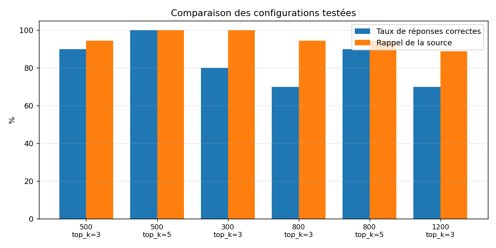

# Rapport de suivi de la qualité — assistant RAG RH

*Généré le 14/09/2026 à 05:03*

Seuil d'alerte : **90%** du taux de réponses correctes.

## 1. Comparaison des configurations

Six configurations ont été évaluées sur le même jeu de 20 questions de référence, en faisant varier la taille de chunk et le nombre de passages retournés (`top_k`).

| Taille chunk | top_k | Taux correct | Rappel source | Erreurs |
|---|---|---|---|---|
| 500 | 3 | 90.0% | 94.4% | 0 |
| 500 | 5 | 100.0% | 100.0% | 0 |
| 300 | 3 | 80.0% | 100.0% | 0 |
| 800 | 3 | 70.0% | 94.4% | 0 |
| 800 | 5 | 90.0% | 94.4% | 0 |
| 1200 | 3 | 70.0% | 88.9% | 0 |

**Configuration retenue :** taille de chunk 500, `top_k` = 5 (100%).

## 2. Suivi dans le temps

Exécutions successives de la configuration retenue.

| Date | Taux correct | Rappel source | Erreurs |
|---|---|---|---|
| 10/09/2026 22:56 | 95.0% | 100.0% | 0 |
| 10/09/2026 23:19 | 95.0% | 100.0% | 0 |
| 10/09/2026 23:48 | 100.0% | 100.0% | 0 |
| 14/09/2026 03:54 | 100.0% | 100.0% | 0 |
| 14/09/2026 04:03 | 95.0% | 100.0% | 0 |
| 14/09/2026 04:21 | 100.0% | 100.0% | 0 |
| 14/09/2026 05:00 | 95.0% | 100.0% | 0 |

## 3. Synthèse

- Exécutions de suivi : **7**
- Taux moyen : **97.1%**
- Taux minimal : **95.0%**
- Franchissements du seuil : **0**

## 4. Limites

- L'historique de suivi couvre une période très courte : le dispositif est opérationnel, mais la détection d'une dérive réelle nécessiterait plusieurs semaines d'exécutions quotidiennes.
- Le jeu de référence compte 20 questions, soit une granularité de 5 points par question. Un jeu plus large permettrait un seuil plus exigeant.
- Des écarts de quelques points entre exécutions identiques ont été observés malgré une température fixée à 0 : une partie de la variation mesurée relève du bruit.
